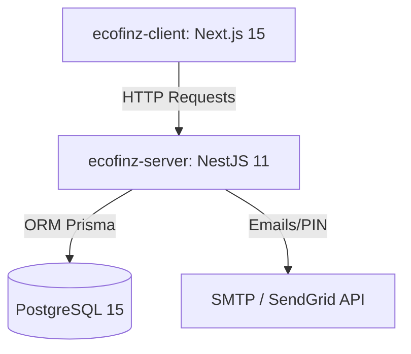

# 🚀 Guía de Arquitectura, Despliegue y Estimación de Costos en Azure para EcoFinz

Esta guía detalla el **stack tecnológico** actual de **EcoFinz** y proporciona tres opciones de arquitectura diferentes para desplegar el sistema en **Microsoft Azure**, incluyendo una estimación de costos detallada para cada una, desde entornos de bajo costo hasta entornos de producción escalables.

---

## 🛠️ 1. Análisis del Stack Tecnológico Actual

El proyecto está estructurado como un monorrepósito dividido en frontend (`ecofinz-client`) y backend (`ecofinz-server`), orquestado localmente mediante Docker Compose.



### 💻 Frontend (`ecofinz-client`)
*   **Framework principal:** **Next.js 15** (React-based).
*   **Lenguaje:** TypeScript.
*   **Estilos:** Tailwind CSS.
*   **Gestión de Estado:** React Context API.
*   **Comunicación:** Axios (cliente HTTP para conectarse al backend).
*   **Runtime de ejecución:** Node.js (requiere SSR o compilación estática).

### ⚙️ Backend (`ecofinz-server`)
*   **Framework principal:** **NestJS 11** (Node.js).
*   **Lenguaje:** TypeScript.
*   **Base de datos / ORM:** **Prisma ORM 7** (con migraciones automatizadas).
*   **Autenticación:** Passport.js y JWT (JSON Web Tokens).
*   **Notificaciones:** Nodemailer o API de SendGrid (para envíos de PIN y recuperación de contraseña).
*   **Runtime de ejecución:** Node.js (servidor express/fastify persistente).

### 🗄️ Base de Datos (`db`)
*   **Motor:** **PostgreSQL 15** (Alpine-based en Docker).
*   **Requerimiento:** Base de datos relacional compatible con Prisma PostgreSQL Connector.

---

## ☁️ 2. Opciones de Arquitectura para Despliegue en Azure

Presentamos tres opciones de despliegue basadas en las mejores prácticas de la industria y la optimización de presupuestos.

### Opción A: Contenedores Serverless (Recomendada 🌟)
Utiliza **Azure Container Apps (ACA)** para el frontend y backend. Es la opción más moderna, flexible y económica para proyectos con tráfico variable porque escala a cero cuando no se usa (reduciendo los costos de cómputo a casi cero en inactividad).

*   **Frontend & Backend:** Azure Container Apps (ACA).
*   **Base de Datos:** Azure Database for PostgreSQL (Flexible Server) - Plan Burstable.
*   **Registro de Imágenes:** Azure Container Registry (ACR) - Basic.

### Opción B: Plataforma como Servicio Tradicional (PaaS)
Utiliza **Azure App Service** con planes Linux para hospedar Next.js y NestJS de manera independiente con un costo fijo mensual predecible.

*   **Frontend & Backend:** Azure App Service para Linux (Planes individuales o compartiendo el mismo App Service Plan).
*   **Base de Datos:** Azure Database for PostgreSQL (Flexible Server).

### Opción C: Servidor Virtual Todo en Uno (IaaS - Ultra Low Cost 💸)
Utiliza una única máquina virtual Linux (Ubuntu) donde se clona el repositorio y se ejecuta con `docker-compose up --build`, tal como funciona localmente. Es la opción más barata para desarrollo, pero requiere mantenimiento manual de parches y actualizaciones del sistema operativo.

*   **Todo el sistema (Client, Server, DB):** Azure Virtual Machine (B-Series).

---

## 💰 3. Estimación Detallada de Costos (USD/Mes)

A continuación, se desglosan los costos estimados para cada arquitectura según las tarifas estándar de Azure en 2026.

### 📊 Comparativa General de Presupuestos Mensuales

| Servicio / Recurso | Opción A: Container Apps (Recomendado) | Opción B: App Service (PaaS) | Opción C: Virtual Machine (IaaS) |
| :--- | :---: | :---: | :---: |
| **Cómputo Frontend & Backend** | $0.00 - $10.00 * | $13.14 (Plan B1 Compartido) | $8.50 (VM B1s) |
| **Base de Datos (PostgreSQL)** | $12.41 (B1ms Burstable) | $12.41 (B1ms Burstable) | $0.00 (Incluida en la VM) |
| **Almacenamiento Base de Datos**| $3.45 (30 GB SSD) | $3.45 (30 GB SSD) | $1.50 (32 GB HDD Estándar) |
| **Container Registry (ACR)** | $5.00 (Basic) | $0.00 (Despliegue local/Git) | $0.00 (Despliegue directo) |
| **Ancho de Banda / Transferencia**| $1.00 - $2.00 | $1.00 - $2.00 | $1.00 |
| **Envío de Emails (SendGrid)** | $0.00 (Plan Gratuito 100/día) | $0.00 (Plan Gratuito 100/día) | $0.00 (Plan Gratuito 100/día) |
| **TOTAL ESTIMADO MENSUAL** | **~$21.86 - $31.86** | **~$29.00 - $32.00** | **~$11.00 - $13.00** |

> [!NOTE]
> \* El costo de cómputo en **Azure Container Apps** puede ser **$0.00 USD** gracias al tier gratuito mensual de Azure que incluye:
> * 180,000 vCPU-segundos gratis.
> * 360,000 GiB-segundos gratis.
> * 2 millones de peticiones HTTP gratis al mes.
> Si la app escala a cero durante la noche u horas de poco tráfico, solo pagarás por los segundos en que se use activamente la aplicación.

---

## 🔍 4. Detalle de Servicios de Azure Seleccionados

### 1. Azure Database for PostgreSQL (Flexible Server)
*   **SKU:** Burstable `Standard_B1ms` (1 vCore, 2 GiB RAM).
*   **Costo de Cómputo:** ~$12.41 USD/mes.
*   **Costo de Almacenamiento:** ~$0.115 USD por GB al mes (30 GB Premium SSD = ~$3.45 USD/mes).
*   **Ventaja:** Totalmente administrado, backups automáticos, escalabilidad con un clic. Soporta parada/inicio para ahorrar dinero cuando no se trabaje en él.

### 2. Azure Container Apps (ACA)
*   **Configuración Frontend:** 0.25 vCPU, 0.5 GiB RAM (Escalabilidad de 0 a 1 réplica).
*   **Configuración Backend:** 0.25 vCPU, 0.5 GiB RAM (Escalabilidad de 0 a 1 réplica).
*   **Costo:** Prácticamente gratis bajo el plan de consumo si el uso es esporádico (desarrollo o bajo volumen). En producción continua con tráfico ligero: ~$10.00 USD/mes en total.

### 3. Azure App Service (Plan Linux B1)
*   **SKU:** `B1` (1 vCore, 1.75 GiB RAM).
*   **Costo:** ~$13.14 USD/mes.
*   **Ventaja:** Puedes hostear tanto el frontend como el backend en el mismo App Service Plan utilizando diferentes rutas o subdominios, pagando únicamente por una instancia.

### 4. Azure Virtual Machine (B1s - Ultra Low Cost)
*   **SKU:** `Standard_B1s` (1 vCore, 1 GiB RAM).
*   **Costo de Cómputo:** ~$8.50 USD/mes.
*   **Almacenamiento (Disco OS):** 32 GB Standard HDD (~$1.50 USD/mes).
*   **Ventaja:** Control total y el menor costo posible. Desventaja: Todo recae sobre ti (seguridad, backups de base de datos, actualización de parches).

---

## 🗺️ 5. Ruta de Migración Paso a Paso (Azure)

Si decides proceder, los pasos lógicos recomendados para el despliegue son:

### Paso 1: Configurar la Base de Datos
1. Crear un recurso **Azure Database for PostgreSQL (Flexible Server)** en la región más cercana a tus usuarios (ej. *East US 2* o *Brazil South*).
2. Configurar las reglas del Firewall para permitir conexiones desde tu IP local (para pruebas) y habilitar la opción de "Permitir acceso público desde cualquier servicio de Azure" (necesario para que NestJS se conecte).
3. Obtener el string de conexión de Azure y actualizar tu variable de entorno `DATABASE_URL` localmente para verificar la conectividad.

### Paso 2: Ejecutar Migraciones
Desde tu directorio `ecofinz-server`, corre las migraciones para estructurar la base de datos de Azure:
```bash
# Apuntando la variable DATABASE_URL a la base de datos de Azure
npx prisma migrate deploy
npx prisma db seed
```

### Paso 3: Dockerizar las Imágenes
Crear y subir las imágenes Docker del cliente y servidor a **Azure Container Registry (ACR)**:
```bash
# Loguearse en ACR
az acr login --name mi_registro_ecofinz

# Construir y taguear imágenes
docker build -t mi_registro_ecofinz.azurecr.io/ecofinz-server ./ecofinz-server
docker build -t mi_registro_ecofinz.azurecr.io/ecofinz-client ./ecofinz-client

# Subir imágenes
docker push mi_registro_ecofinz.azurecr.io/ecofinz-server
docker push mi_registro_ecofinz.azurecr.io/ecofinz-client
```

### Paso 4: Desplegar en Azure Container Apps o App Service
1. Crear una Container App para el **Backend** (`ecofinz-server`). Configurar las variables de entorno (`DATABASE_URL`, `JWT_SECRET`, `PORT`, `SENDGRID_API_KEY`). Habilitar la entrada HTTP (Ingress) en el puerto `3001` de forma pública.
2. Crear una Container App para el **Frontend** (`ecofinz-client`). Configurar la variable `NEXT_PUBLIC_API_URL` apuntando a la URL pública generada por el backend en el paso anterior. Habilitar el Ingress en el puerto `3000`.

### Paso 5: Configuración de Dominios y SSL (Gratis en Azure)
Azure asigna automáticamente certificados SSL gratuitos (`https://...`) para todos sus dominios autogenerados (`.azurecontainerapps.io` o `.azurewebsites.net`). Si añades dominios propios (ej. `app.ecofinz.com`), Azure te provee certificados SSL administrados sin costo extra.

---

### 💡 Recomendación Final

*   **Para Desarrollo y Pruebas iniciales:** La **Opción C (Máquina Virtual B1s)** es ideal porque simula exactamente tu entorno local de `docker-compose` con un presupuesto cerrado de menos de **$13 USD al mes** (incluyendo base de datos).
*   **Para Producción Formal:** La **Opción A (Container Apps)** es la mejor opción a largo plazo. Es escalable, moderna, segura, y te ofrece alta disponibilidad con la base de datos de PostgreSQL administrada, manteniéndose en un presupuesto muy controlado de **~$25 USD al mes**.
