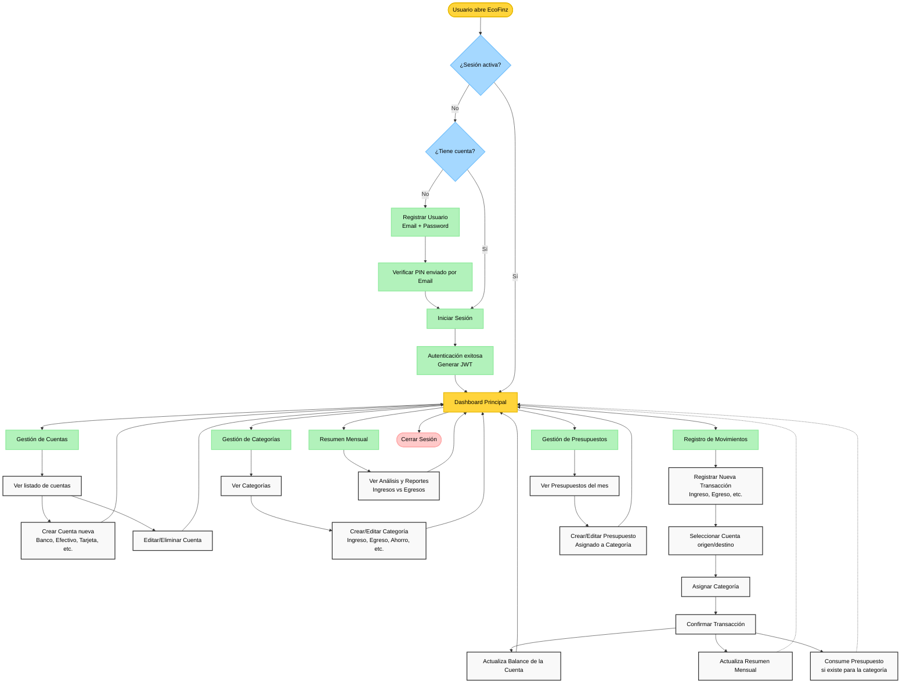

# EcoFinz - Flujo de Usuario

Este diagrama de Mermaid representa el flujo completo que un usuario sigue al interactuar con la aplicación EcoFinz, desde el registro y autenticación, hasta la gestión de sus finanzas (cuentas, movimientos, presupuestos, categorías y resúmenes).

